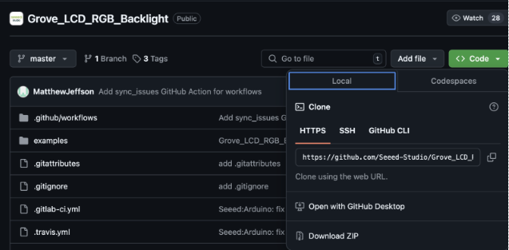
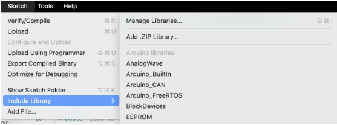
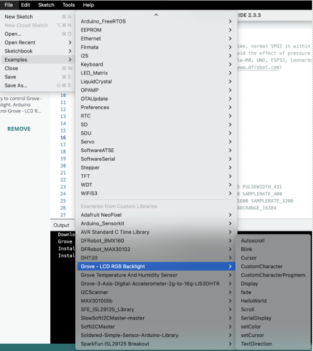
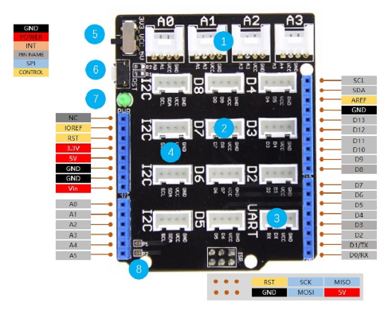
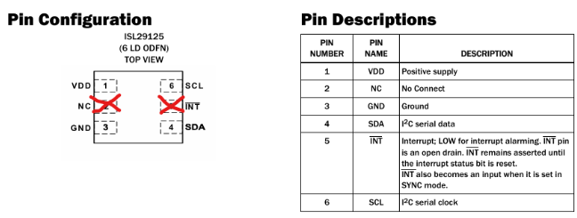
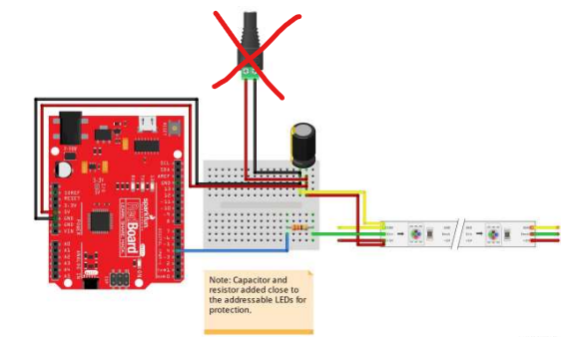
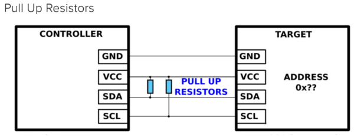

# Sensor Start-Up Guide
A step-by-step guide on how to  implement arduino sensor modules into python workspaces.

### Contents:
1. [Arduino IDE Setup](#1-arduino-ide-setup)
    * [Arduino Board And Port Setup](#arduino-board-and-port-setup)
    * [Intalling Libraries](#installing-libraries)
2. [Communication from Arduino to Python](#2-communicating-from-arduino-to-python)
3. [Arduino Shield Connections](#3-arduino-shield-connections)
4. [Sensor Set-Up](#4-sensor-setup)
    * [Color Sensor](#colro-sensor)
    * [Accelerometer](#accelerometer)
    * [Pulse Oximeter](#pulse-oximeter)
    * [Sound Sensor](#sound-sensor)
    * [Temperature & Humidity Sensor](#temperature-&-humidity-sensor)
    * [LEDs](#leds)
    * [LCD Display](#lcd-display)
5. [Useful Functions](#5-useful-functions)
6. [Common Problems](#6-commmon-problems)

## 1. Arduino IDE Setup

### Arduino Board and Port Setup
Before you can begin coding, you should configure your Arduino IDE to the specific arduino you are using. In this case you will be using the "Arduino UNO R4 Minima".

1. Go to the bar at the top of the screen that reads "Select Board". 
2. Select the option "Select other board and port".
3. Search the board name "Arduino UNO R4 Minima", then select it.
4. Select the port which the arduino is connected to from the drop-down menu, then click "ok". 
**If the port you are using is not shown, select "show all ports". 
**If you don't know the port ID, go to your "Device Manager" to find the ID under "Ports".

### Installing Libraries
The required libraries for each sensor are listed in [Sensor Setup](#4-sensor-setup), use this [Link](https://docs.arduino.cc/software/ide-v1/tutorials/installing-libraries/) for more help installing libraries.
#### Method 1: Using the Arduino R4
Search for the Library name in the ‘library manager” in the Arduino IDE and install.  

#### Method 2: Downloading Library Zip File
##### Steps:
1. Download the library from GitHub as a .zip file  

2. Once downloaded simply browse to the Arduino IDE and add the library as a zip file. 
 (Sketch -> Include Library -> Add .ZIP Library)  

3. Browse to File -> Examples and then find your library and click on the example to get some example code for how to use that library.   

## 2. Communicating From Arduino to Python
All communication is done via the Serial port.

### Arduino Code
* Function to receive data from Serial port, only if data wrapped with <> ex. < hi >  
[recvWithStartEndMarkers()](Arduino%20Code/ArduinoPythonDisplay.ino#L126-L178)
* Function to use received data from Serial Port. 
[void replyToPython()](Arduino%20Code/ArduinoPythonDisplay.ino#L180-L210)

### Python Code
* Code used to read data from the arduino Serial Monitor  
[ArduioToPython](Arduino%20Code/Sensor%20Test%20Code/ArduinoToPython.py?ref_type=heads)

## 3. Arduino Shield Connections
The Grove Base Shield V2 is an Arduino compatible board with Grove ports. This component fits directly on top of the Arduino UNO ports allowing for connections to be easily made to grove seeeduino modules (sensors) and multiple I2C connections. 
1. 4 Analog Ports: A0, A1, A2 and A3. 
2. 7 Digital Ports: D2, D3, D4, D5, D6, D7 and D8. 
3. 1 UART Port: UART. 
4. I2C Ports: 4 I2C ports. 
5. Power Switch: when using Arduino UNO with Base Shield v2, please turn the switch to 5v position. 
6. Reset Buton: reset the arduino board. 
7. PWR LED: The Green LED turns on when power on. 

Each of the white connection ports is labelled with that port’s required connections. Each white port should only be connected to one sensor/module.  

When connecting modules to the arduino, ensure wires are connected to the correct locations such that GND on the sensor goes to GND on the shield, VCC to VCC, SDA to SDA, and so on. 

For analog and digital pins, there are 4 connection points but only 3 are needed. The pin number that is printed on the shield next to the port is the connection that should be used for data transmission.    

## 4. Sensor Setup

Use the resources under each sensor type to learn more about how the sensor works, what libraries are needed, and how to connect it to your arduino.
#### Test Code
For the test codes provided for each sensor, open a blank Arduino IDE tab to copy and paste to code into.

#### Serial Monitor
The Serial Monitor will display the code outputs. This can be opened by clicking on the magnifying glass icon in the top right-hand corner of the screen. 

#### Baud Rate
Each test code runs a setup function to initialize the code settings, Serial.begin() initializes the Serial Monitor baud rate. Whatever number is initialized in the Setup() function must match the baud rate value in the Serial Monitor.

***
### **Color Sensor**
[Part Link](https://www.digikey.ca/en/products/detail/sparkfun-electronics/SEN-12829/5673756?s=N4IgTCBcDaIIwFYBsAOAtHOB2ADGgcgCIgC6AvkA)
#### Libraries
* [SparkFun_ISL29125_Breakout](https://github.com/sparkfun/ISL29125_Breakout.git) -Alaso available in Arduino IDE Library Manger
#### Documents
* [Hookup Guide](https://mm.digikey.com/Volume0/opasdata/d220001/medias/docus/1208/SIL29125_Sensor_HookupGuide.pdf)
* [Datasheet](https://www.renesas.com/en/document/dst/isl29125-datasheet)
#### Hookup 
Color Sensor needs to be connected to an I2C port on the base shield to allow connection to SDA and SCL pins. In this diagram VDD represents VCC, otherwise the pin names should match to the required pins on the base shield.   
Use Breadboard to attach wires from the respected sensor pin to the Base Shield.  

#### Calibration
Update the values in the code labeled as “redhigh”, “greenhigh”, “bluehigh” in the code below to the highest raw values read in the serial monitor when color sensor is in an environment with bright ambient lighting. This will act as the highest level of brightness and baseline bright value (255, 255, 255). 

Set values labeled as “redlow”, “greenlow”, “bluelow” to the lowest values when the sensor is in an environment with dark ambient lighting (dark room). This will act as your lowest level of brightness and baseline dark color (0,0,0) 
#### Code
* [Color Sensor Test Code](Arduino%20Code/Sensor%20Test%20Code/ColorSensor_test.ino?ref_type=heads)
  

***
### **Accelerometer**
[Part Link]()
#### Libraries
* [DFRobot_BMX160 ](https://github.com/DFRobot/DFRobot_BMX160)
#### Documents
* [Datasheet](https://img.dfrobot.com.cn/wiki/none/40e914cf5839ec7f4d10675f34f8f78c.pdf)
* [Setup Guide](https://wiki.dfrobot.com/BMX160_9_Axis_Sensor_Module_SKU_SEN0373)
#### Hookup
The accelerometer uses an I2C port on the Base Shield which requires a VCC, GND, SCL, and SDA connection. Each pin should be connected to the corresponding pin of the same name on the Base Shield, with the other pins on the sensor left disconnected.  
Use Breadboard to attach wires from the respected sensor pin to the Base Shield. 
#### Code
Run the following code to output the accelerometer x, y, and z acceleration values to the serial monitor. When laid flat on the table, the z-axis should read ~-9.81m/s2 and the other two values should read ~0. Example code provided by the library can also be used for further understanding of the accelerometer functions. 
* [Accelerometer Test Code](Arduino%20Code/Sensor%20Test%20Code/Accelerometer_test.ino?ref_type=heads)
  

***
### **Pulse Oximeter**
[Part Link](https://www.digikey.ca/en/products/detail/analog-devices-inc-maxim-integrated/maxrefdes117/6165562)
#### Libraries
* [DFRobot_MAX30102 Arduino Library ](https://github.com/DFRobot/DFRobot_MAX30102)
#### Documents 
* [Datasheet](https://mm.digikey.com/Volume0/opasdata/d220001/medias/docus/1222/MAXREFDES117_Web.pdf)
#### Hookup
On the pulse-oximeter sensor, two sides of the sensor there is a single connection point (GND or VIN), and on the other two sides there are three connection points (each with INT, SCL, and SDA).   
This sensor uses an I2C connection, so we need to use the GND and VIN (VCC), as well as one set of the SDA and SCL pins (from the same side). INT pins are NOT used.  
Use Breadboard to attach wires from the respected sensor pin to the Base Shield. 
#### Code
* [Pulse-Oximeter Test Code](Arduino%20Code/Sensor%20Test%20Code/PulseOximeter_test.ino?ref_type=heads)
  

***
### **Sound Sensor**
[Part Link](https://wiki.seeedstudio.com/Grove-Sound_Sensor/)
#### Libraries
No additional libraries needed for this sensor.
#### Documents
* [Datasheet](https://files.seeedstudio.com/wiki/Grove_Sound_Sensor/res/LM358.pdf)
#### Hookup
Using one of the analog ports on the Base Shield, simply use the provided 4-prong connection wires to directly connect the sensor to the Base Shield, ensuring proper connections are made (GND to GND, VCC to VCC, etc.)
#### Code
* [Sound Sensor Test Code](Arduino%20Code/Sensor%20Test%20Code/SoundSensor_test.ino?ref_type=heads)  

***
### Temperature & Humidity Sensor
[Part Link]()
#### Libraries
* [Arduino_SensorKit]()
#### Docuents
* No Additional Documentation
#### Hookup
The temperature and humidity sensor uses a digital pin connection. Ensure the pin labled data in connected to the proper digital pin referenced in the code/ change it to match, and the GND and VCC pins connect to corresponding pins on Base Shield.
#### Code
* [Temp & Humidity Test Code](Arduino%20Code/Sensor%20Test%20Code/TempHumid_test.ino?ref_type=heads)

***
### **LEDs** 
[Part Link](https://www.digikey.ca/en/products/detail/sparkfun-electronics/COM-15206/10064425?s=N4IgTCBcDaIIwFYBsAOAtAYQPIFk2LAAYk0A5AERAF0BfIA)
#### Libraries
* [Adafruit_NeoPixel](Adafruit_NeoPixel ) - Also available in Ardiuno IDE Library Manger
#### Documents
* [Hookup Guide](https://mm.digikey.com/Volume0/opasdata/d220001/medias/docus/1179/WS2812_Breakout_Hookup_Guide.pdf)
#### Hookup
The Circuit diagram below shows the correct wire configuration between the LED strip and arduino digital port. The capacitor (black cylinder) should be between 100µF and 1000µF, and the capacitor (striped cylinder) should be between 220Ω and 470Ω. This setup will protect the LED’s.    
Using a breadboard to connect the components, ensure proper connection of +5V (on LED) to VCC (on arduino shield), - (on LED) to GND (on arduino shield), and Di (on LED) to D6 (on arduino shield).   
More information can be found in “Hookup Guide” in documents above.  

#### Code
Running the code below with the correct pin setup should turn the LEDs in circuit with the arduino a light purple color. Change the “red”, “green”, and “blue” values and upload code to get different color outputs! 
* [LED Test Code](Arduino%20Code/Sensor%20Test%20Code/LED_test.ino?ref_type=heads)   

***
### **LCD Display**
[Part Link](https://wiki.seeedstudio.com/Grove-LCD_RGB_Backlight/)
#### Libraries
* [Grove LCD RGB Backlight](https://github.com/Seeed-Studio/Grove_LCD_RGB_Backlight) - Also available in Arduino IDE Library Manger
#### Documents
* [Datasheet](https://mm.digikey.com/Volume0/opasdata/d220001/medias/docus/1081/104030001_Web.pdf)
#### Hookup
the Grove LCD Display is not compatible with the Arduino R4 and will require pull-up resistors to function correctly. Use a breadboard to set up 4kΩ to 6kΩ  resistors in the configuration shown below. 
  
The LCD Display uses I2C ports, so connect the VCC, GND, SDA, and SCL connection to the corresponding ports on the Base Shield.
#### Code
* [LCD Display Test Code](Arduino%20Code/Sensor%20Test%20Code/lcdDisplay_test.ino?ref_type=heads)

## 5. Useful Functions
Below are some functions made to help you implement the sensors into a functional prototype

### Arduino
* [printJson()](Arduino%20Code/ArduinoPythonDisplay.ino#L273-L330) - Prints sensor data to Serial Monitor in json string format to make reading data into python easier. 
* [recvWithStartEndMarkers()](Arduino%20Code/ArduinoPythonDisplay.ino#L126-L178) - Read data sent from python when formatted with start and end markers (i.e.< hello >)
* [replyToPython()](Arduino%20Code/ArduinoPythonDisplay.ino#L180-L210) - Reply back to python with actions takn after the data that was sent to arduino was read.
* [color_3digit()](Arduino%20Code/ArduinoPythonDisplay.ino#L253-L257) - Takes an integer input and formats the number into 3-digits, padding the front with 0's if needed.
* [parseColorValues()](Arduino%20Code/ArduinoPythonDisplay.ino#L259-L271) - Takes a 9-digit color code input and splits it into 3 3-digit values for "red", "green", and "blue".

### Python
* [read_arduino_data()](Python%20Code/index.py#L123-L149) - Reads data sent from Arduino Serial monitor and assigns values to designated variables.
* [outputStringToDisplay()](Python%20Code/sensorHelper.py#L42-L48) - Writes text string to arduino with start and end markers to be read.
* [parseArduinojson()](Python%20Code/sensorHelper.py#L34-L40) - loads line from Serial Monitor as json string if the line starts with "{". 
* **Color Sensor:**
    * [constrain()](Python%20Code/sensorHelper.py#L67-L73) - constrains a value "n" to within a range [minn, maxn].
    * [color_3digit()](Python%20Code/sensorHelper.py#L58-L65) - Takes an integer input and formats the number into 3-digits, padding the front with 0's if needed.
    * [outputColorToDisplay()](Python%20Code/sensorHelper.py#L50-L56) - Writes color hex code to arduino with start and end markers plus the color tag "+".
    * [colorCalculation()](Python%20Code/sensorHelper.py#L76-L116) - calculates the color light needed to be shown on LEDs in order to make ambiant light color meet desired goal (based on color sensor input).
* **Pulse Oximeter**
    * [parse_heart_value()](Python%20Code/sensorHelper.py?ref_type=heads#L21-L32) - assigns HR and SPO2 values to variables in memory if valid inputs are read.

* **Accelerometer** (defining sleep vs awake):
    * [read_serial()](Python%20Code/sensorHelper.py#L122-L136) - reads wrist accelerometer data from the Serial Monitor.
    * [calculate_angle()](Python%20Code/sensorHelper.py#L138-L150) - Calcucates the patients arm angle based on accelerometer values read from serial monitor.
    * [five_sec_average()](Python%20Code/sensorHelper.py#L156-L173) - calculates the average arm angle of the patient over 5 seconds, then adds that value to z_angle_avg list to be used later.
    * [Identify_sleep_state(angle_input_list)](/tree/main/Dashboard/Python%20Code/sensorHelper.py#L176-L212) - Output the state of sleep the patient is currently in based of the change in their arm angle. sensitivity can be changed throught the angle tolerance value, along with the threshold time in which the data must remain stable for.

## 6. Commmon Problems  
Type | Error   | How to Fix
-----|---------|---------------------
General |Sensor not reading any values   |- Push in all connections.   - Change wires to see if that’s the issue.   - Wrong pin/ port declared in setup, check values. 
Genral | Encountering Library Error codes | - Ensure all libraries called in code are installed and are accessable.   - Copy and paste code into new tab and run.
Compilation | "Could not open port" (Python) | - Ensure port name in “Device Manager” matches port referenced in code.   - Ensure Serial monitor in arduino is NOT open.   - Push in port connection wire.
Compilation |"Failed to retrieve language identifiers" (Arduino) | - Restart Arduino by pushing the reset button twice fast (built-in light should start pulsing).
Compilation |"Inconsistent use of indentation" (Python) | - “Shift” + “>” then type “tabs” and click “Convert Indentation to Tabs”.
Compilation |Not recognizing I2C devices | - Run I2C scanner and see if there are devices found. 
Compilation |Python not reading data outputted from arduino | - Ensure output data appears in the serial monitor when the monitor is open.   - If not showing in Serial Monitor, re-uploading code and restarting arduino.
Pulse-Oximeter|Sensor reading very inconsistent values | - Adjust the parameters in the calibration to allow for better/longer reads.  
Color Sensor | Sensor will only read (0, 0, 0) or (255, 255, 255) |- Re-calibrate sensor to environment lighting.   - Sensor is not properly initialized (GRB not RGBW). 
LCD Display | Only color showing and no text | - Check if it is plugged to 5V and not 3.3V. 
